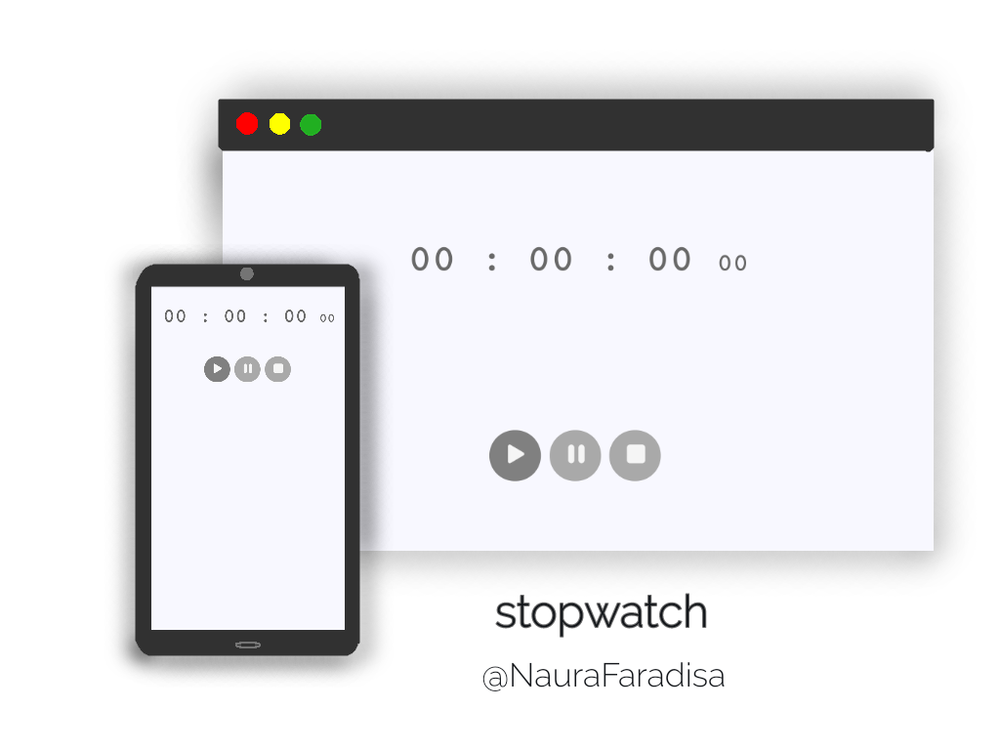

# Stopwatch

_Simple stopwatch by using **html**, **css**, and **javascript**_

[NauraFaradisa.github.io/Stopwatch](https://NauraFaradisa.github.io/Stopwatch)

## Browser Support

<table style="text-align: center">
    <tr>
        <td></td>
        <td></td>
        <td></td>
        <td></td>
        <td></td>
    </tr>
    <tr>
        <td> 4.0 </td>
        <td> 9.0 </td>
        <td> 3.0 </td>
        <td> 3.1 </td>
        <td> 10.5</td>
    </tr>
    
</table>

## Author
[@NauraFaradisa](https://github.com/NauraFaradisa)

## Tags

[HTML](https://github.com/topics/html)
[CSS](https://github.com/topics/css)
[Javascript](https://github.com/topics/javascript)

## Find a bug?
[report](https://github.com/NauraFaradisa/Stopwatch/issues)