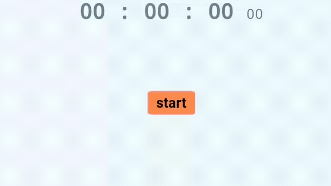

# Stopwatch
---

_Simple stopwatch by using **html**, **css**, and **javascript**_

[ --> view on my github page](https://NauraFaradisa.github.io/Stopwatch)

## Preview

## Browser Support

### HTML Object

|chrome|ie|firefox|safari|opera|
|---|---|---|---|---|
| all | all | all | all | all |

### CSS Property and Value

|chrome|ie|firefox|safari|opera|
|---|---|---|---|---|
| 4.0 | 9.0 | 3.0 | 3.1 | 10.5 |

### JS Method

|chrome|ie|firefox|safari|opera|
|---|---|---|---|---|
| 1.0 | 4.0 | 1.0 | 1.0 | 4.0 |

## Reference

[w3schools.com/jsref/...](https://www.w3schools.com/jsref/met_win_setinterval.asp)

[htmlcolorcodes.com/color-...](https://htmlcolorcodes.com/color-names/)

[https://caniuse.com/](https://caniuse.com/)

## About

Author : [Naura Faradisa](https://github.com/NauraFaradisa)

## Tags

`HTML` `CSS` `Javascript`
